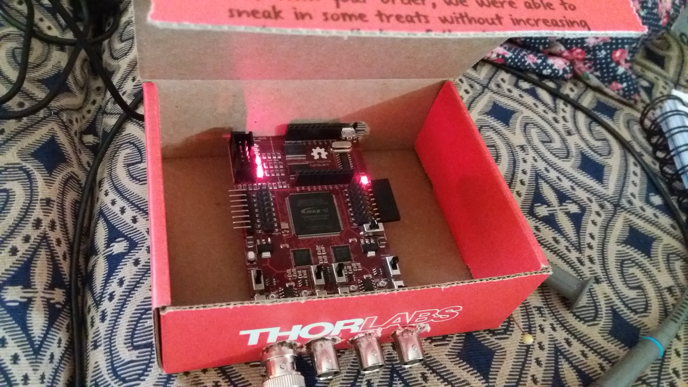
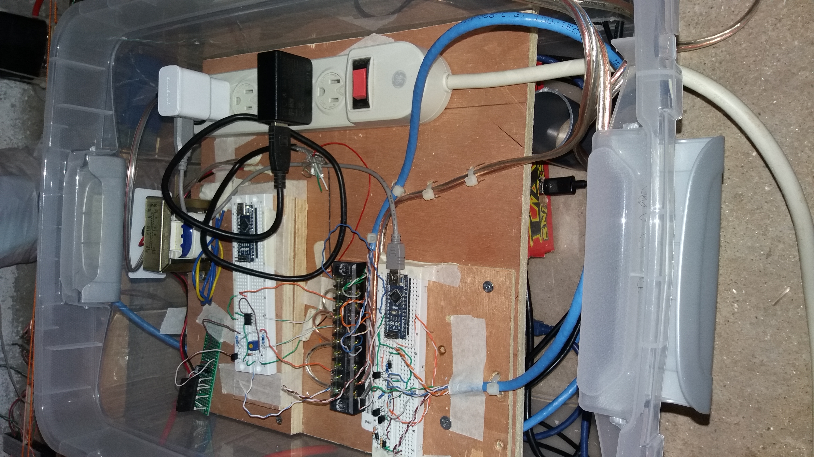

## Wavelength measurement

The wavelength of light changes when its source is moving relative to an observer. The same phenomenon happen when the source of light is still relative to the observer, but the light is reflected from a moving mirror. Here I use this technique to generate that change in wavelength.
 
This is the description of such experiment. This has be done with available materials, due to a limited budget.
For example, instead of using an optical table, the elements are placed over a concrete floor, so it is subject to natural ocurring vibrations.
That is not a problem in this case, as the interferometer is common, and only the phase difference is needed (more details on this are given in the interferometer section) 

Haasoscope "professional" box

Control Box

This experimental setup const of several modules:

- [Mechanical setup](mechanicalSetup/index.md)
- Control and Measurement
- Interferometer
